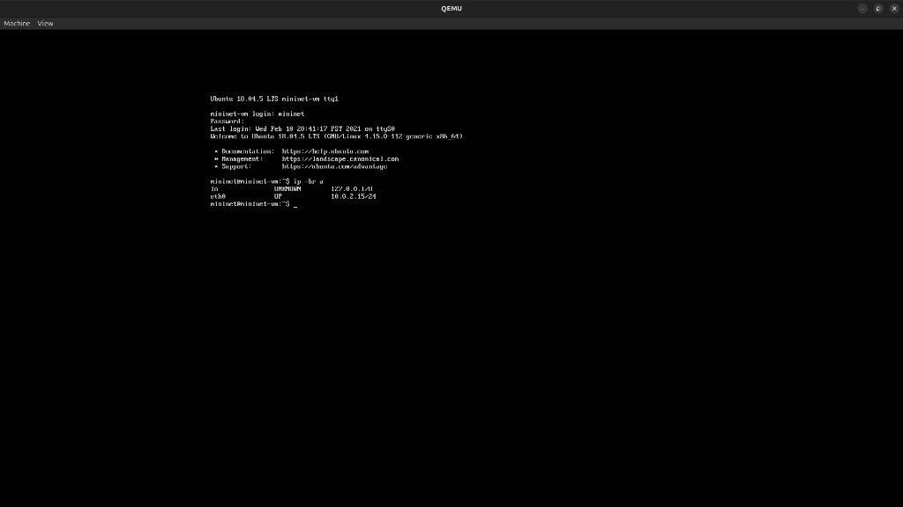

# Mininet on QEMU + OpenFlow

`host-setup-qemu-mininet.sh` prepares the official Mininet VM on the host. `guest-setup-ryu-and-apt.sh` installs Ryu inside that VM.

The guest image is Ubuntu 18.04.5, Mininet 2.3.0, Python 3.6.9. Login is `mininet` / `mininet`. The image is 1 vCPU, 1024 MB RAM, and an 8 GB disk. The host script uses 2 vCPUs and 2048 MB. The host this was written on had QEMU 8.2.2.

## Host

Download the VM from the [Mininet GitHub releases](https://github.com/mininet/mininet/releases). This setup uses the Ubuntu 18.04.5 image on the 2.3.0 release, `mininet-2.3.0-210211-ubuntu-18.04.5-server-amd64-ovf.zip`. Unzip it and pass the `.vmdk` to the script below. The `.ovf` in that zip is unused.

Run this on the host, from the directory where you want `mininet.qcow2`.

```bash
./host-setup-qemu-mininet.sh /path/to/mininet-vm-x86_64.vmdk
```

The script requires `vmx` or `svm` in `/proc/cpuinfo`. If the kvm module is not loaded, it loads `kvm_intel` when the CPU has `vmx`, and `kvm_amd` otherwise. If `/dev/kvm` is still missing, it exits and tells you to check `dmesg` for `disabled by bios`, then enable VT-x or AMD-V in the BIOS and reboot.

If the current user is not in the `kvm` group, it runs `usermod -aG kvm`. The new group applies to the next login. Until then, wrap the QEMU command with `sg kvm -c "..."`.

It checks for `qemu-system-x86_64` and `qemu-img`. A missing `qemu-system-x86_64` means install `qemu-system-x86` and `qemu-utils`. A missing `qemu-img` means install `qemu-utils`.

When `mininet.qcow2` is not already in the current directory, it converts the vmdk. It then prints this launch command:

```bash
qemu-system-x86_64 -enable-kvm -m 2048 -smp 2 -drive file=mininet.qcow2,format=qcow2 -netdev user,id=n1,hostfwd=tcp::2222-:22 -device e1000,netdev=n1 -display gtk
```

After the VM boots, the GTK console looks like this. Login there is `mininet` / `mininet`. `eth0` comes up as `10.0.2.15/24`.



SSH in:

```bash
ssh -p 2222 mininet@localhost
```

## Guest

Copy `guest-setup-ryu-and-apt.sh` onto the VM, then run it there:

```bash
ssh -p 2222 mininet@localhost
./guest-setup-ryu-and-apt.sh
```

It saves `/etc/apt/sources.list` as `/etc/apt/sources.list.bak` and rewrites every `http://` to `https://`. It runs `apt install -y apt-transport-https` and continues if that install fails, then runs `apt update`.

If `~/.bashrc` does not already mention `.local/bin`, it appends `export PATH="$HOME/.local/bin:$PATH"` and exports that path for the current shell. `pip3 install --user` puts `ryu-manager` in `~/.local/bin`.

It then runs `pip3 install --user ryu`, `pip3 install --user "netaddr==0.8.0"`, and `pip3 install --user "eventlet==0.30.2"`. Those two pins keep the install importable on Python 3.6. The script ends with `ryu-manager --version`, which should print `ryu-manager 4.34`.

## OpenFlow check

The guest script prints this check when it finishes. Use two SSH sessions into the VM.

Terminal 1 is the controller. `simple_switch_13` learns source MACs and installs an output flow for each known destination.

```bash
ryu-manager ryu.app.simple_switch_13
```

Terminal 2 is one switch with three hosts, pointed at Ryu on `127.0.0.1:6653`.

```bash
sudo mn --topo single,3 --controller=remote,ip=127.0.0.1,port=6653
mininet> pingall
```

`pingall` should report `0% dropped (6/6 received)`. Ryu logs `packet in` events for that traffic.

From another shell on the VM, print the flow table Ryu installed on `s1`:

```bash
sudo ovs-ofctl dump-flows s1
```
